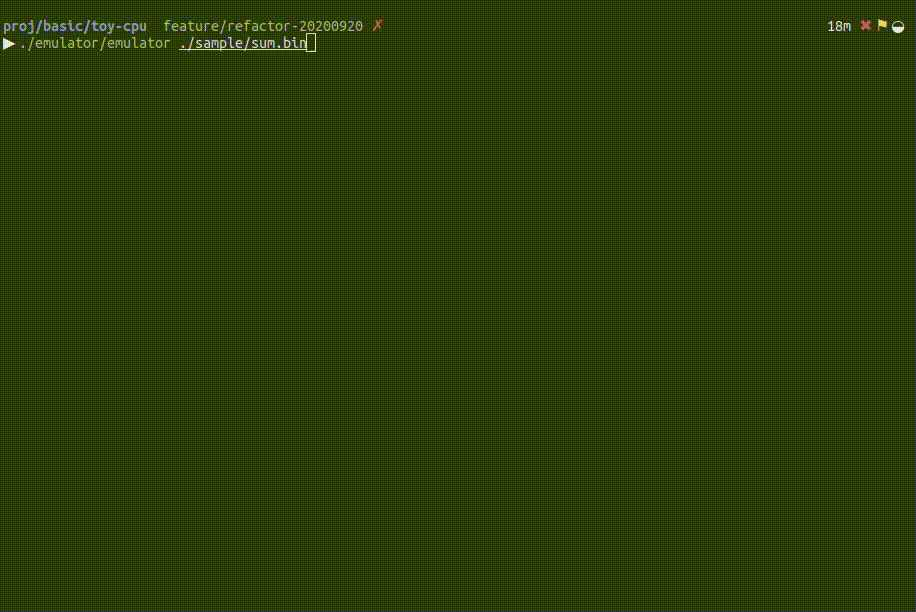

# toy-cpu

A toy cpu for learning basic cpu architecture.
This repository contains assembler, emulator and sample assembly code.



## Getting Started

```
cmake .
make

# assemble sum.s to sum binary
./assembler/assembler ./sample/sum.s ./sample/sum.bin

# emulate cpu with sum program
./emulator/emulator ./sample/sum.bin
```

## Architecture

|||
|:---:|:---:|
|CPU bit|16bit|
|number of Register|8|
